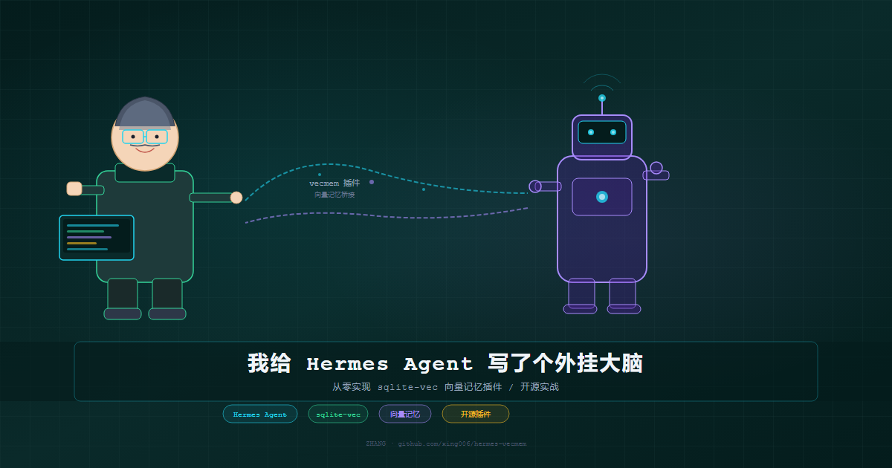
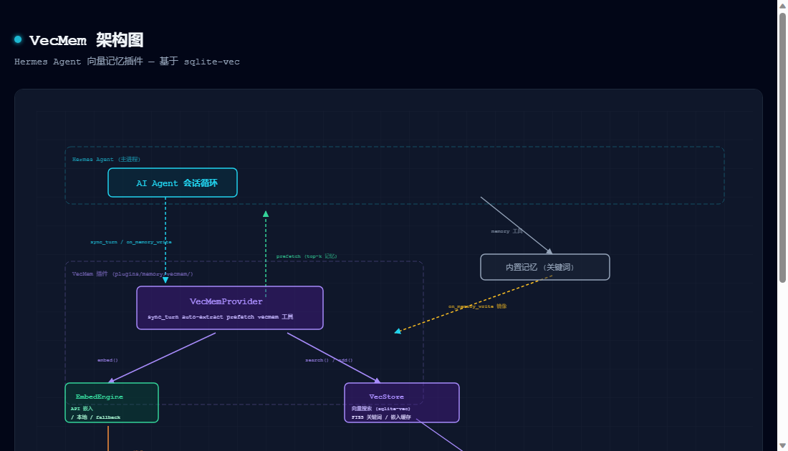

# 我给 Hermes Agent 写了个外挂大脑：从零实现向量记忆插件

> 当 AI Agent 的记忆只能用关键词匹配时，我决定自己动手。



## 痛点：AI 的"健忘症"

如果你用过 Hermes Agent、Claude Code 这类 AI 编程助手，一定会遇到这个场景：

你告诉它"我的项目在 e:/projects/ruoyi-vue"，它记住了。五轮对话后你问"我的项目在哪"，它说"抱歉，我不记得了"。

这不是因为它蠢，而是因为 **Hemes 的内置记忆是关键词匹配**。存进去的是一条文本，找回来的时候必须用一模一样的关键词才能命中。

"项目"搜不到"ruoyi-vue"，"前端"搜不到"Vue.js"。

这就像图书馆没有索引卡，你只知道要找一本关于"前端"的书，但书名全是"Vue.js"——翻遍书架也找不到。

我需要一种**按语义搜索**的记忆。

## 选型：为什么是 sqlite-vec？

| 方案 | 优点 | 缺点 |
|------|------|------|
| chromadb | 成熟，功能全 | 依赖重(~200MB)，额外进程 |
| faiss | 性能顶尖 | C++ 编译，Windows 折腾 |
| **sqlite-vec** | **零进程，纯 SQLite 扩展** | **相对较新** |

选 sqlite-vec 的理由很简单：Hermes 本身就是 SQLite 重度用户——会话存档、看板任务全用 SQLite。加个向量扩展是顺理成章的事。

```bash
pip install sqlite-vec
# 搞定，零配置
```

## 架构设计



整个插件分三层：

```
┌─────────────────────────────┐
│   __init__.py               │  ← MemoryProvider 接口 + 工具注册
│   (对话提取 + prefetch 调度) │
├─────────────────────────────┤
│   embed.py                  │  ← 嵌入引擎
│   (API / 本地 / 降级)       │     把文本变成向量
├─────────────────────────────┤
│   store.py                  │  ← sqlite-vec 数据库
│   (向量搜索 + FTS5 关键词)  │     存向量 + 搜向量
└─────────────────────────────┘
```

### 嵌入引擎：三级降级

这是最核心的设计决策。嵌入（把文本变成向量）需要调 AI 模型，但如果 API 挂了怎么办？

```
API 模式（调 DeepSeek/OpenAI 嵌入 API）
  ↓ API 不可用
本地模型（sentence-transformers，需要 pip install）
  ↓ 也没装
Hash 降级（SHA-256 转伪向量，能精确匹配相同文本）
```

**稳健降级**——最坏情况也能精确匹配相同文本，只是不能做语义联想。

### 混合检索：两条腿走路

```
用户搜 "前端框架"
  ├→ 向量搜索 → 找到 "Vue.js"、"React"、"Angular"（语义）
  └→ FTS5 搜索 → 找到包含"前端"、"框架"的条目（关键词）
```

向量搜语义，关键词兜底，两者互补。

### 缓存：省钱的学问

每调一次嵌入 API，都要花钱（虽然便宜）。如果每轮对话都调一遍，积少成多。

```
内存缓存（dict）→ 命中 → 直接返回（纳秒级）
  ↓ 未命中
SQLite 缓存 → 命中 → 回填内存（毫秒级）
  ↓ 未命中  
调 API → 回填 SQLite + 内存（几百毫秒）
```

用户说了一次"我的项目是 e:/projects/ruoyi-vue"，之后再说同样的话，直接命中缓存，零成本。

## 开发过程

按 solution-lifecycle 闭环推进：

1. **提问题** — 内置记忆只有关键词匹配
2. **出方案** — sqlite-vec 向量库插件
3. **做计划** — 7 个任务分步执行
4. **执行** — 逐任务编码
5. **验证** — 单元测试 + 集成测试 + 真实会话加载验证
6. **优化（P0）** — 维度自适应 + 嵌入缓存
7. **优化（P1）** — 对话自动提取事实
8. **打包发布** — 提取为独立项目，推 GitHub

## 与官方插件对比

Hermes 官方已经带了一个本地记忆插件 `holographic`，但它是"符号派"——用 HRR（全息归约表示）做代数语义搜索，不用神经网络。

| 特性 | vecmem（我的） | holographic（官方） |
|------|--------------|-------------------|
| 搜索方式 | **向量语义搜索**（sqlite-vec） | HRR 符号代数 |
| 关键词 | ✅ FTS5 | ✅ FTS5 |
| 精度 | ⭐⭐⭐⭐（真实嵌入） | ⭐⭐（代数近似） |
| 依赖 | sqlite-vec + httpx | 无（numpy 可选） |
| 嵌入 | API / 本地 / 三级降级 | 无嵌入 |

简单说：holographic 不需要任何外部依赖就能跑，但精度有限。我的方案追求精度，代价是需要调一次嵌入 API（或用本地模型）。

## 效果演示

其实原理很简单，看个测试：

```python
# 存入
vecmem add content="用户喜欢用 Vue.js 做前端开发"
vecmem add content="默认模型是 DeepSeek v4 flash"

# 搜索
vecmem search query="用什么框架"  
# → "用户喜欢用 Vue.js 做前端开发"（语义匹配）

# 关键词搜索
vecmem keyword query="Vue"
# → "用户喜欢用 Vue.js 做前端开发"（精确匹配）
```

语义搜索能跨表述找到相关内容，关键词搜索做精确匹配兜底。

## 项目地址

代码已开源：

**https://github.com/xing006/hermes-vecmem**

里面包含：
- 完整插件源码（可直接放入 Hermes 源码树）
- 中英文文档
- 安装脚本
- requirements.txt

---

最后说一句：AI Agent 的记忆不应该只是"存进去、原样取出来"。向量化之后，它才开始真正"理解"用户说过什么。

---

*作者：ZHANG | 一个爱折腾 AI Agent 的开发者*
